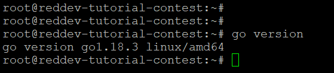

# Introduction

This tutorial will show you how to add a Precompile contracts to the subnet-evm.

We at [red·dev](https://www.red.dev) needed to do learn how to do this for our current software project under development, [RediYeti](https://www.rediyeti.com). In our case, we needed our dApp (on the C-Chain) to gather information from the Avalanche P-Chain, and because Avalanche does not allow this natively, we built a Chainlink adapter to do this job. 

You, however, can follow this same methodology to gather any real-world information that your dApp needs, by following this tutorial and just designing your Chainlink adapter to gather different information.

In this tutorial, we describe each step of setting up the environment by hand. For more information, see the **Resources** section at the end of this tutorial.

## Audience
To get the most out of this tutorial, you will need to have a basic understanding of Docker, Chainlink, Javascript, Node, Solidity, and how to write dApps. If you do not yet know about these topics, see the [**Resources**](#resources) section at the end for links to learn more.


## Overview

At the very highest level, here is an overview of the process we will take you through in this tutorial. First we are going to show you how to install the necessary software required to run the subnet-evm in local network, and then we will will explain to you how to add the Precompile contracts within the subnet-evm. After that, with the help of the Remix, we can create a simple Solidity interface and connect with the Precompile.

# Prerequisites

1. Ubuntu 20.04 or later
2. [Go 1.18.3](https://storage.googleapis.com/golang/go1.18.3.linux-amd64.tar.gz)
3. [Metamask wallet](https://metamask.io/) set up for use with Local EVM subnet
4. User with _sudo_ access

## Install Go

Download the Go package. We have used version 1.18.3 for this tutorial:
```
$ wget https://storage.googleapis.com/golang/go1.18.3.linux-amd64.tar.gz
```
Extract go1.18.3.linux-amd64.tar.gz to /usr/local:
```
$ tar -C /usr/local -xzf go1.18.3.linux-amd64.tar.gz
```
Add /usr/local/go/bin to the PATH environment variable. You can do this by adding the following line to your $HOME/.profile or /etc/profile (for a system-wide installation):

```
export PATH=$PATH:/usr/local/go/bin
```
Verify that you've installed Go by running the command below:

```
$ go version
```


Set `$GOPATH` environment variable properly for Go to look for Go Workspaces. Please read [this](https://go.dev/doc/gopath_code) for details. You can verify by running `echo $GOPATH`.

As a few software will be installed into `$GOPATH/bin`, please make sure that `$GOPATH/bin` is in your `$PATH`, otherwise, you may get error running the commands below

## Clone Subnet-evm

Download the [`subnet-evm`](https://github.com/ava-labs/subnet-evm.git) repository into your `$GOPATH`:

```sh
cd $GOPATH
mkdir -p src/github.com/ava-labs
cd src/github.com/ava-labs
git clone git@github.com:ava-labs/subnet-evm.git
cd subnet-evm
```

This will clone and checkout to `master` branch.

## Build Stateful Precompiles

To add a new custom Precompiles into subnet-evm we have to do below steps

1. Modify the [precompile/params.go](./precompile/params.go) - which is used to define the designated address for the stateful precompiles
2. Create your own custom precompile contracts and place under [precompile](./precompile/) folder. In this tutorial we have creates [contract_xchain_ecrecover.go](./precompile/contract_xchain_ecrecover.go)
3. Modify the [params/config.go](./params/config.go) - this helps to add the chain configuration and managed the subnet-evm via the genesis.json file. Since, the precompiles is optional and can be added or removed from the subnet-evm at anytime which can be managed by the genesis.json file.
4. Modify the [scripts/run.sh](./scripts/run.sh) to include the custom precompile configuration 

### Modify the [precompile/params.go](./precompile/params.go) file

As said earlier, the [precompile/params.go](./precompile/params.go) is used to define the designated address for the stateful precompiles. It has also mentioned that the designated address should not be conflict with the any other precompiles addresses. For forks of subnet-evm, users should start at 0x0300000000000000000000000000000000000000 to ensure that their own modifications do not conflict with stateful precompiles that may be added to subnet-evm in the future.

We have taken the address `0x0300000000000000000000000000000000000000` for this tutorial.

We have modified the below changes in the [params.go](./precompile/params.go) file

at [line 13](./precompile/params.go#L13) we have declared the gas estimation value. see below,

```diff
const (
	ModifyAllowListGasCost = 20_000
	ReadAllowListGasCost   = 5_000
	MintGasCost = 30_000
+	XChainECRecoverCost = 10_000
)
```

next, at [line 28](./precompile/params.go#L28) we have declared varaible ContractXchainECRecoverAddress and assign the designated contract address. see below,

```diff
var (
	ContractDeployerAllowListAddress = common.HexToAddress("0x0200000000000000000000000000000000000000")
	ContractNativeMinterAddress      = common.HexToAddress("0x0200000000000000000000000000000000000001")
	TxAllowListAddress               = common.HexToAddress("0x0200000000000000000000000000000000000002")
+   ContractXchainECRecoverAddress   = common.HexToAddress("0x0300000000000000000000000000000000000000")
	UsedAddresses = []common.Address{
		ContractDeployerAllowListAddress,
		ContractNativeMinterAddress,
		TxAllowListAddress,
+       ContractXchainECRecoverAddress,
	}
)
```
### Create a new custom [contract_xchain_ecrecover.go](./precompile/contract_xchain_ecrecover.go) contracts

We have created the below precompile contracts. The stateful precompile contract should implement the intrefaces Address(), Contract(), Configure() and Timestamp().

The xChainECRecoverReadSignature holds the function selector which can be used in solidity smart contracts to execute the precompile.

TODO

The getXChainECRecover() function holds the business logic for verify the signature and return the Xchain address


```
// (c) 2019-2020, Ava Labs, Inc. All rights reserved.
// See the file LICENSE for licensing terms.

package precompile

import (
	"math/big"

	"github.com/ava-labs/subnet-evm/vmerrs"
	"github.com/ethereum/go-ethereum/common"
)

var (
	_ StatefulPrecompileConfig = &ContractXChainECRecoverConfig{}
	// Singleton StatefulPrecompiledContract for XChain ECRecover.
	ContractXChainECRecoverPrecompile StatefulPrecompiledContract = createXChainECRecoverPrecompile(ContractXchainECRecoverAddress)

	xChainECRecoverReadSignature = CalculateFunctionSelector("getXChainECRecover(string)")
)

// ContractXChainECRecoverConfig uses it to implement the StatefulPrecompileConfig
type ContractXChainECRecoverConfig struct {
	BlockTimestamp *big.Int `json:"blockTimestamp"`
}

// Address returns the address of the XChain ECRecover contract.
func (c *ContractXChainECRecoverConfig) Address() common.Address {
	return ContractXchainECRecoverAddress
}

// Contract returns the singleton stateful precompiled contract to be used for the XChain ECRecover.
func (c *ContractXChainECRecoverConfig) Contract() StatefulPrecompiledContract {
	return ContractXChainECRecoverPrecompile
}

// Configure configures [state] with the desired admins based on [c].
func (c *ContractXChainECRecoverConfig) Configure(state StateDB) {
	
}

func (c *ContractXChainECRecoverConfig) Timestamp() *big.Int { return c.BlockTimestamp }

// getXChainECRecover returns an execution function that reads the input and return the input from the given [precompileAddr].
// The execution function parses the input into a string and returns the string
func getXChainECRecover(precompileAddr common.Address) RunStatefulPrecompileFunc {
	return func(evm PrecompileAccessibleState, callerAddr common.Address, addr common.Address, input []byte, suppliedGas uint64, readOnly bool) (ret []byte, remainingGas uint64, err error) {
		if remainingGas, err = deductGas(suppliedGas, XChainECRecoverCost); err != nil {
			return nil, 0, err
		}

		out := []byte(string(input[:]))
		return out, remainingGas, nil
	}
}

// createXChainECRecoverPrecompile returns a StatefulPrecompiledContract with R/W control of an allow list at [precompileAddr] and a native coin minter.
func createXChainECRecoverPrecompile(precompileAddr common.Address) StatefulPrecompiledContract {
	funcGetXChainECRecover := newStatefulPrecompileFunction(xChainECRecoverReadSignature, getXChainECRecover(precompileAddr))

	// Construct the contract with no fallback function.
	contract := newStatefulPrecompileWithFunctionSelectors(nil, []*statefulPrecompileFunction{xChainECRecover,funcGetXChainECRecover})
	return contract
}
```


### Modify the [params/config.go](./params/config.go) file

As said earlier, the [params/config.go](./params/config.go) is used to add the chain configuration and managed the subnet-evm via the genesis.json file.

We have modified the below changes in the [params.go](./precompile/params.go) file

at [line 122](./params/config.go#L122) we have added the new custom contract `ContractXChainECRecoverConfig` in the ChainConfig struct with this we add or remove the precompiles through genesis.json file

```diff
type ChainConfig struct {
	ChainID *big.Int `json:"chainId"` // chainId identifies the current chain and is used for replay protection
    .....
    .....
+   ContractXChainECRecoverConfig	precompile.ContractXChainECRecoverConfig   `json:"contractXChainECRecover,omitempty"` 		  // Config for the contract XChain ECrecover
}
```

next, at [line 563](./params/config.go#L563) we have included our custom precompiles intio the stateful precompiled configs

```diff
func (c *ChainConfig) enabledStatefulPrecompiles() []precompile.StatefulPrecompileConfig {
	statefulPrecompileConfigs := make([]precompile.StatefulPrecompileConfig, 0)

	if c.ContractDeployerAllowListConfig.Timestamp() != nil {
		statefulPrecompileConfigs = append(statefulPrecompileConfigs, &c.ContractDeployerAllowListConfig)
	}
    .....
    .....
+   if c.ContractXChainECRecoverConfig.Timestamp() != nil {
+ 		statefulPrecompileConfigs = append(statefulPrecompileConfigs, &c.ContractXChainECRecoverConfig)
+ 	}
}
```
next, at [line 496](./params/config.go#L496) we have introduced a boolean variable `IsContractXChainECRecoverEnabled` only enabled precompiles map the addresses to the stateful precompiled

```diff
type Rules struct {
	ChainID                                                 *big.Int
  .....
  .....

	// Optional stateful precompile rules
	IsContractDeployerAllowListEnabled bool
	IsContractNativeMinterEnabled      bool
	IsTxAllowListEnabled               bool
+ 	IsContractXChainECRecoverEnabled   bool

	// Precompiles maps addresses to stateful precompiled contracts that are enabled
	// for this rule set.
	// Note: none of these addresses should conflict with the address space used by
	// any existing precompiles.
	Precompiles map[common.Address]precompile.StatefulPrecompiledContract
}
```

next, at [line 533](./params/config.go#L496) we have set the enabled status of the `IsContractXChainECRecoverEnabled` by checking whether a fork scheduled at given block timestamp is active at the given head block.

```diff
func (c *ChainConfig) AvalancheRules(blockNum, blockTimestamp *big.Int) Rules {
  .....
  .....
  rules.IsContractDeployerAllowListEnabled = c.IsContractDeployerAllowList(blockTimestamp)
	rules.IsContractNativeMinterEnabled = c.IsContractNativeMinter(blockTimestamp)
	rules.IsTxAllowListEnabled = c.IsTxAllowList(blockTimestamp)
+ 	rules.IsContractXChainECRecoverEnabled = c.IsXChainECRecover(blockTimestamp)

	// Initialize the stateful precompiles that should be enabled at [blockTimestamp].
	rules.Precompiles = make(map[common.Address]precompile.StatefulPrecompiledContract)
    .....

	return rules
}
```

next, at [line 261] create a function to return the fork enabled status based on block timestamp

```diff
func (c *ChainConfig) IsTxAllowList(blockTimestamp *big.Int) bool {
	return utils.IsForked(c.TxAllowListConfig.Timestamp(), blockTimestamp)
}
+ func (c *ChainConfig) IsXChainECRecover(blockTimestamp *big.Int) bool {
+	  return utils.IsForked(c.ContractXChainECRecoverConfig.Timestamp(), blockTimestamp)
+ }
```

### Modify the [scripts/run.sh](./scripts/run.sh)

The [scripts/run.sh](./scripts/run.sh) by default include the default configuration. Since, the precompiles created under precompile folder are optional and can be added to the subnet-evm by configuring in the genesis.json file.

We have to modify the default genesis.json setting in the [scripts/run.sh](./scripts/run.sh) to enable our custom precompile.

at [line 125](./scripts/run.sh#L125) under config object we have added the configuration for custom precompile. The configuration name `contractXChainECRecover` can be derived from [params/config.go line 122](./params/config.go#L122)

```diff
{
  "config": {
    "chainId": $CHAIN_ID,
    "homesteadBlock": 0,
    "eip150Block": 0,
    .....
    .....
    "feeConfig": {
      "gasLimit": 20000000,
      .....
      .....
      "blockGasCostStep": 500000
    },
+     "contractXChainECRecover": {
+       "blockTimestamp": 0
+     }
  },
  "alloc": {
    "${GENESIS_ADDRESS:2}": {
      "balance": "0x52B7D2DCC80CD2E4000000"
    }
  },
  "nonce": "0x0",
  ....
  ....

}
```

## Run the Local Subnet-evm

The final step is to run the local subnet-evm

[`scripts/run.sh`](https://github.com/ava-labs/subnet-evm/blob/master/scripts/run.sh) automatically installs `avalanchego`, sets up a local network,
and creates a `subnet-evm` genesis file. The usage of this script is

```bash
./scripts/run.sh [AVALANCHEGO VERSION] [GENESIS_ADDRESS]
```


```bash
# to startup a local cluster (good for development)
cd ${HOME}/go/src/github.com/ava-labs/subnet-evm
./scripts/run.sh 1.7.13 0x8db97C7cEcE249c2b98bDC0226Cc4C2A57BF52FC
```

Note that this ewoq address (`0x8db97C7cEcE249c2b98bDC0226Cc4C2A57BF52FC`) is a prefunded address on the local network, see [here](https://docs.avax.network/quickstart/fund-a-local-test-network) for more info. The private key for this address is
`0x56289e99c94b6912bfc12adc093c9b51124f0dc54ac7a766b2bc5ccf558d8027`.

With this command, `avalanchego`, `avalanche-network-runner` and GoLang packages will be downloaded and installed on a `/tmp` directory. Note: please make sure that your have fast internet connection to download these packages, otherwise, it will take a long time.

Once the the network is started up, the following info will be printed to the
console:

```bash
cluster is ready!

Logs Directory: /var/folders/0h/v4nrbbsn1vvbr5h2wfrh5h500000gn/T/network-runner-root-data2328077371

EVM Chain ID: 99999
Funded Address: 0x8db97C7cEcE249c2b98bDC0226Cc4C2A57BF52FC
RPC Endpoints:
- http://127.0.0.1:14463/ext/bc/28N1Tv5CZziQ3FKCaXmo8xtxoFtuoVA6NvZykAT5MtGjF4JkGs/rpc
- http://127.0.0.1:23930/ext/bc/28N1Tv5CZziQ3FKCaXmo8xtxoFtuoVA6NvZykAT5MtGjF4JkGs/rpc
- http://127.0.0.1:31984/ext/bc/28N1Tv5CZziQ3FKCaXmo8xtxoFtuoVA6NvZykAT5MtGjF4JkGs/rpc
- http://127.0.0.1:41274/ext/bc/28N1Tv5CZziQ3FKCaXmo8xtxoFtuoVA6NvZykAT5MtGjF4JkGs/rpc
- http://127.0.0.1:57529/ext/bc/28N1Tv5CZziQ3FKCaXmo8xtxoFtuoVA6NvZykAT5MtGjF4JkGs/rpc

WS Endpoints:
- ws://127.0.0.1:14463/ext/bc/28N1Tv5CZziQ3FKCaXmo8xtxoFtuoVA6NvZykAT5MtGjF4JkGs/ws
- ws://127.0.0.1:23930/ext/bc/28N1Tv5CZziQ3FKCaXmo8xtxoFtuoVA6NvZykAT5MtGjF4JkGs/ws
- ws://127.0.0.1:31984/ext/bc/28N1Tv5CZziQ3FKCaXmo8xtxoFtuoVA6NvZykAT5MtGjF4JkGs/ws
- ws://127.0.0.1:41274/ext/bc/28N1Tv5CZziQ3FKCaXmo8xtxoFtuoVA6NvZykAT5MtGjF4JkGs/ws
- ws://127.0.0.1:57529/ext/bc/28N1Tv5CZziQ3FKCaXmo8xtxoFtuoVA6NvZykAT5MtGjF4JkGs/ws

MetaMask Quick Start:
Funded Address: 0x8db97C7cEcE249c2b98bDC0226Cc4C2A57BF52FC
Network Name: Local EVM
RPC URL: http://127.0.0.1:14463/ext/bc/28N1Tv5CZziQ3FKCaXmo8xtxoFtuoVA6NvZykAT5MtGjF4JkGs/rpc
Chain ID: 99999
Curreny Symbol: LEVM
network-runner RPC server is running on PID 79100...

use the following command to terminate:

pkill -P 79100
kill -2 79100
pkill -9 -f srEXiWaHuhNyGwPUi444Tu47ZEDwxTWrbQiuD7FmgSAQ6X7Dy
```

You can then ping the local cluster or add the network to MetaMask:

```bash
curl --location --request POST 'http://127.0.0.1:14463/ext/bc/28N1Tv5CZziQ3FKCaXmo8xtxoFtuoVA6NvZykAT5MtGjF4JkGs/rpc' \
--header 'Content-Type: application/json' \
--data-raw '{
    "jsonrpc": "2.0",
    "method": "eth_blockNumber",
    "params":[],
    "id": 1
}'
```

Response:

```json
{
  "jsonrpc": "2.0",
  "id": 1,
  "result": "0x0"
}
```

To terminate the cluster, run the following commands:

```bash
pkill -P 79100
kill -2 79100
pkill -9 -f srEXiWaHuhNyGwPUi444Tu47ZEDwxTWrbQiuD7FmgSAQ6X7Dy
```

## Connect with Metamask

Please use the value provided by `MetaMask Quick Start` to connect with Metamask.

```text
MetaMask Quick Start:
Funded Address: 0x8db97C7cEcE249c2b98bDC0226Cc4C2A57BF52FC
Network Name: Local EVM
RPC URL: http://127.0.0.1:14463/ext/bc/28N1Tv5CZziQ3FKCaXmo8xtxoFtuoVA6NvZykAT5MtGjF4JkGs/rpc
Chain ID: 99999
Curreny Symbol: LEVM
```

You can create a new metamask account by importing the private key `0x56289e99c94b6912bfc12adc093c9b51124f0dc54ac7a766b2bc5ccf558d8027` and start experiencing with this account.


## Using the Precompile from Remix

You can copy paste the Solidity interface [contract_xchain_ecrecover.sol](./precompile/contract_xchain_ecrecover.sol) into Remix and compile it by hitting “Compile contract_xchain_ecrecover.sol”.

TODO


Once you’ve compiled the interface, you can navigate to the Deploy tab in remix, select “Injected Web3” for your local environment so that you can interact with your EVM instance, and paste the address 0x0300000000000000000000000000000000000000 of the precompile in the field to the right of “At Address”.

TODO


Clicking “At Address” will deploy the interface at that address, as if you had deployed a fully implemented contract in Solidity and from there you can interact with the precompile directly in Solidity.

# Resources
Here is a list of resources that can give you a detailed idea of what is mentioned in this tutorial.


1. [Customizing the EVM with Stateful Precompiles](https://medium.com/avalancheavax/customizing-the-evm-with-stateful-precompiles-f44a34f39efd)
2. [Customise a subnet](https://docs.avax.network/subnets/customize-a-subnet)
3. [Create an EVM Subnet on a Local Network](https://docs.avax.network/subnets/create-a-local-subnet)