# Precompile Generation Tutorial

We can now generate a stateful precompile with the Precompile gen tool!

### Assumption of Knowledge
Before starting this tutorial it would be helpful if you had some context on the EVM, precompiles, and stateful precompiles. 
Here are some resources to get started put together. 

- [The Ethereum Virtual Machine](https://github.com/ethereumbook/ethereumbook/blob/develop/13evm.asciidoc)
- [Precompiles in Solidity](https://medium.com/@rbkhmrcr/precompiles-solidity-e5d29bd428c4)
- [Deconstructing a Smart Contract](https://blog.openzeppelin.com/deconstructing-a-solidity-contract-part-i-introduction-832efd2d7737/)
- [Layout of State Variables in Storage](https://docs.soliditylang.org/en/v0.8.10/internals/layout_in_storage.html)
- [Layout in Memory](https://docs.soliditylang.org/en/v0.8.10/internals/layout_in_memory.html)
- [Layout of Call Data](https://docs.soliditylang.org/en/v0.8.10/internals/layout_in_calldata.html)
- [Contract ABI Specification](https://docs.soliditylang.org/en/v0.8.10/abi-spec.html)
- [Customizing the EVM with Stateful Precompiles](https://medium.com/avalancheavax/customizing-the-evm-with-stateful-precompiles-f44a34f39efd)
- [Precompiles in Solidity](https://medium.com/@rbkhmrcr/precompiles-solidity-e5d29bd428c4)
- [Customizing the EVM with Stateful Precompiles](https://medium.com/avalancheavax/customizing-the-evm-with-stateful-precompiles-f44a34f39efd)

 
## Tutorial

Let's start by creating the Solidity interface that we want to implement. We can put this  in `./contract-examples/contracts`

```
// (c) 2022-2023, Ava Labs, Inc. All rights reserved.
// See the file LICENSE for licensing terms.

// SPDX-License-Identifier: MIT

pragma solidity >=0.8.0;

interface IHelloWorld {
  function sayHello() external returns (string calldata);

  function setGreeting(string calldata response) external;
}
```

Now we have an interface that our precompile can implement!
Let's create an [abi](https://docs.soliditylang.org/en/v0.8.13/abi-spec.html#:~:text=Contract%20ABI%20Specification-,Basic%20Design,as%20described%20in%20this%20specification.) of our solidity code.

In the same `./contract-examples/contracts` directory, let's run

```
solcjs --abi IHelloWorld.sol
```

This spits out the abi code. Let's move it into a brand new folder in 
`./contract-examples/contracts/contract-abis`. 

IHelloWorld.abi

```
[{"inputs":[],"name":"sayHello","outputs":[{"internalType":"string","name":"","type":"string"}],"stateMutability":"nonpayable","type":"function"},{"inputs":[{"internalType":"string","name":"recipient","type":"string"}],"name":"setGreeting","outputs":[],"stateMutability":"nonpayable","type":"function"}]
```


## Precompile tool

The precompile tool can take in 4 arguments. 


### `--abi` (string):

It needs an ABI input so it can bind it to the precompile template.

`--abi ./contract-examples/contracts/contract-abis/IHelloWorld.abi`

### `--type `(string):

It takes in a type which it uses as a struct name for the precompile. This is optional 
and will default to the abi name. 

`--type HelloWorld`

### `--pkg` (string):

It also takes in a pkg, which is the package name to generate the precompile into. 
This is optional and it defaults to "precompile".

`--pkg precompile` 

### `--out `(string):

Finally it can take in an out which is the path and name of the output file of the generated precompile. 

`--out ./precompile/hello_world.go`

Currently it can only generate precompiles in Golang only.  


## Generating the precompile 

Now that we have an abi for the precompile gen tool to interact with. We can run the following command to generate our HelloWorld precompile!


In the root of the repo run 
```
go run ./cmd/precompilegen/main.go --abi ./contract-examples/contracts/contract-abis/IHelloWorld.abi --type HelloWorld --pkg precompile --out ./precompile/hello_world.go
```

Wow! We just got a precompile template that's mostly complete located at `./precompile/hello_world.go`. Let's fill out the rest!

The precompile gives us commented instructions on the first 25 lines of the autogenerated file. Let's look at the 10 steps and follow them step by step.

```
/* General guidelines for precompile development:
1- Read the comment and set a suitable contract address in precompile/params.go. E.g:
	HelloWorldAddress = common.HexToAddress("ASUITABLEHEXADDRESS")
2- Set gas costs here
3- It is recommended to only modify code in the highlighted areas marked with "CUSTOM CODE STARTS HERE". Modifying code outside of these areas should be done with caution and with a deep understanding of how these changes may impact the EVM.
Typically, custom codes are required in only those areas.
4- Add your upgradable config in params/precompile_config.go
5- Add your precompile upgrade in params/config.go
6- Add your solidity interface and test contract to contract-examples/contracts
7- Write solidity tests for your precompile in contract-examples/test
8- Create your genesis with your precompile enabled in tests/e2e/genesis/
9- Create e2e test for your solidity test in tests/e2e/solidity/suites.go
10- Run your e2e precompile Solidity tests with 'E2E=true ./scripts/run.sh'
```
## Step 1: Set Contract Address

In `./precompile/params.go` let's set a precompile address. We can cut the
address from the var declaration block and remove it from the precompile. 
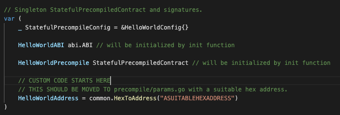
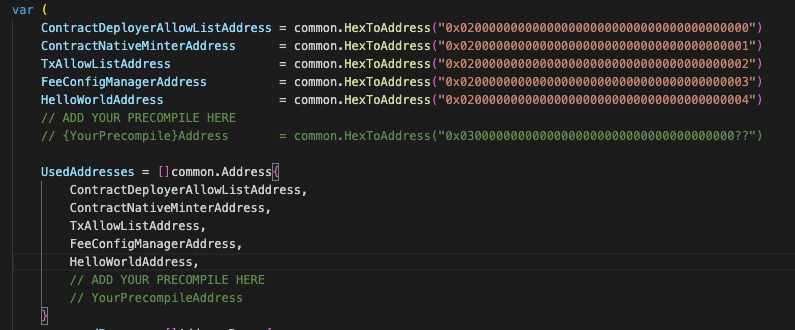

Now when subnet-evm sees the `HelloWorldAddress` as input when executing [`Call`](../core/vm/evm.go#L222), it can [run the precompile](https://github.com/ava-labs/subnet-evm/blob/master/core/vm/evm.go#L271-L272)

## Step 2: Set Gas Costs

Set up gas costs. In `precompile/params.go` we have `writeGasCostPerSlot` and `readGasCostPerSlot`. This is a good starting point for estimating gas costs. 

```// Gas costs for stateful precompiles

const (
	writeGasCostPerSlot = 20_000
	readGasCostPerSlot  = 5_000
)
```

For example, 

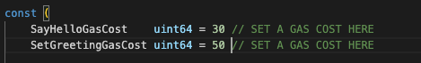

**Example:** 
The sha256 precompile computes gas with the following equation
```
// This method does not require any overflow checking as the input size gas costs
// required for anything significant is so high it's impossible to pay for.
func (c *sha256hash) RequiredGas(input []byte) uint64 {
	return uint64(len(input)+31)/32*params.Sha256PerWordGas + params.Sha256BaseGas
}
```

We'll probably have to come back later and change these costs. 

## Step 3: Add Custom Code

Ok time to `CTRL F` throughout the file with `CUSTOM CODE STARTS HERE` to find the areas in the precompile that we need to modify. 

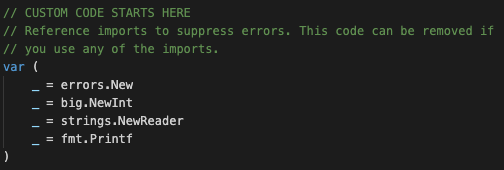

If we use any of the following imports we can remove the reference imports.
We can come back if needed to remove. Next we see this in `Equals()`.

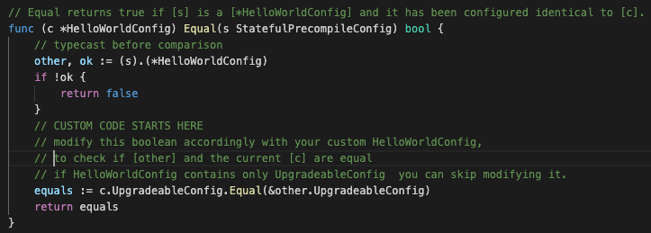

We can skip this step since our HelloWorldConfig struct looks like this.

```
// HelloWorldConfig implements the StatefulPrecompileConfig
// interface while adding in the HelloWorld specific precompile address.
type HelloWorldConfig struct {
	UpgradeableConfig
}
```

**Optional Note** 

If our IHelloWorldConfig wrapped another config in its struct to implement the StatefulPrecompileConfig
like so 

```
// IHelloWorldConfig implements the StatefulPrecompileConfig
// interface while adding in the IHelloWorld specific precompile address.
type IHelloWorldConfig struct {
	UpgradeableConfig
  AllowListConfig
}
```

We would have modify the `Equal()` function as follows: 

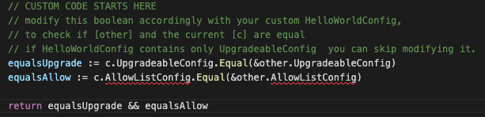

The next place we see the `CUSTOM CODE STARTS HERE` is in `Configure()`
Let's set it up. 

```
// Configure configures [state] with the initial configuration.
func (c *HelloWorldConfig) Configure(_ ChainConfig, state StateDB, _ BlockContext) {
	// CUSTOM CODE STARTS HERE
	// This will be called in the first block where HelloWorld stateful precompile is enabled.
	// 1) If BlockTimestamp is nil, this will not be called
	// 2) If BlockTimestamp is 0, this will be called while setting up the genesis block
	// 3) If BlockTimestamp is 1000, this will be called while processing the first block
	// whose timestamp is >= 1000
	//
	// Set the initial value under [common.BytesToHash([]byte("storageKey")] to "Hello World!"
	res := common.LeftPadBytes([]byte("Hello World!"), common.HashLength)
	state.SetState(IHelloWorldAddress, common.BytesToHash([]byte("storageKey")), common.BytesToHash(res))
}
```

Next place to modify is in our `sayHello()` function.

```
func sayHello(accessibleState PrecompileAccessibleState, caller common.Address, addr common.Address, input []byte, suppliedGas uint64, readOnly bool) (ret []byte, remainingGas uint64, err error) {
	if remainingGas, err = deductGas(suppliedGas, SayHelloGasCost); err != nil {
		return nil, 0, err
	}
	if readOnly {
		return nil, remainingGas, vmerrs.ErrWriteProtection
	}
	// no input provided for this function

	// CUSTOM CODE STARTS HERE
	// Get the current state
	currentState := accessibleState.GetStateDB()
	// Get the value set at recipient
	value := currentState.GetState(IHelloWorldAddress, common.BytesToHash([]byte("storageKey")))
	// Do some processing and pack the output
	packedOutput, err := PackSayHelloOutput(string(common.TrimLeftZeroes(value.Bytes())))
	if err != nil {
		return nil, remainingGas, err
	}

	// Return the packed output and the remaining gas
	return packedOutput, remainingGas, nil
}
```

Finally we can modify our `setGreeting()` function 

```
func setGreeting(accessibleState PrecompileAccessibleState, caller common.Address, addr common.Address, input []byte, suppliedGas uint64, readOnly bool) (ret []byte, remainingGas uint64, err error) {
	if remainingGas, err = deductGas(suppliedGas, SetGreetingGasCost); err != nil {
		return nil, 0, err
	}
	if readOnly {
		return nil, remainingGas, vmerrs.ErrWriteProtection
	}
	// attempts to unpack [input] into the arguments to the SetGreetingInput.
	// Assumes that [input] does not include selector
	// You can use unpacked [inputStruct] variable in your code
	inputStr, err := UnpackSetGreetingInput(input)
	if err != nil {
		return nil, remainingGas, err
	}

	// CUSTOM CODE STARTS HERE
	// setGreeting is the execution function of "SetGreeting(name string)" and sets the storageKey in the string returned by hello world
	res := common.LeftPadBytes([]byte(inputStr), common.HashLength)
	accessibleState.GetStateDB().SetState(IHelloWorldAddress, common.BytesToHash([]byte("storageKey")), common.BytesToHash(res))

	// this function does not return an output, leave this one as is
	packedOutput := []byte{}

	// Return the packed output and the remaining gas
	return packedOutput, remainingGas, nil
}
```

## Step 4: Add Upgradable Config

Let's now modify `params/precompile_config.go`. We can `CTRL F` for `ADD YOUR PRECOMPILE HERE`. 

Let's add our key. 

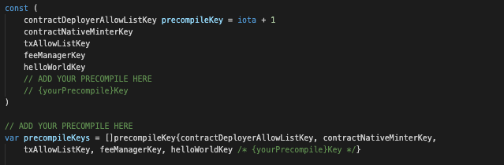

Let's add our precompile config to `PrecompileUpgrade`

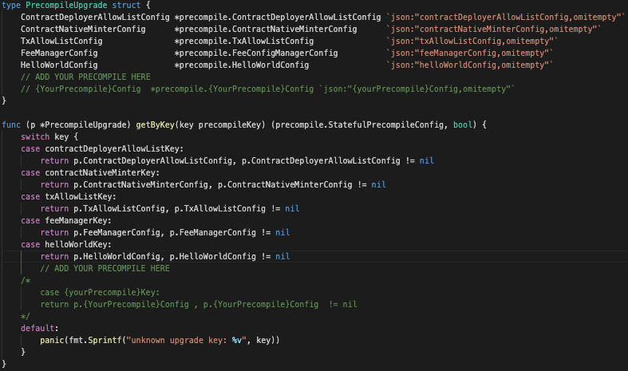

Finally, we can add a getter function. 

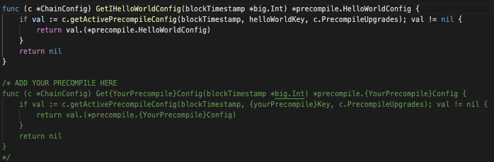

Done! All we had to do was follow the comments.


## Step 5: Add Precompile Upgrade

Let's add our precompile upgrade in `params/config.go`. We can `CTRL F` for `ADD YOUR PRECOMPILE HERE`. 

Let's add the bool to check if our precompile is enabled.  

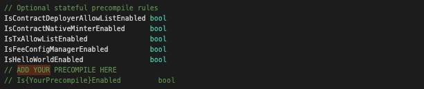

We can now add it to the Avalanche rules. 

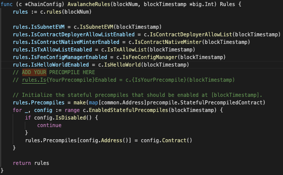

Lastly, we can add `IsHelloWorld` which checks if we are equal or greater than the fork `blockTimestamp`. 
We use this to see if we should enable the precompile. 

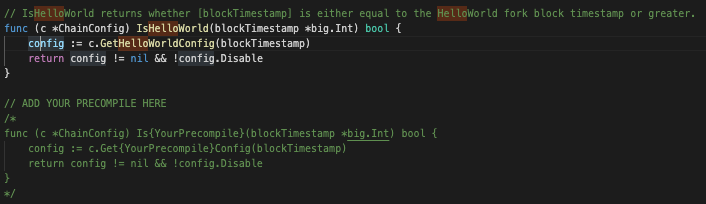

## Step 6: Add Solidity Interface and Test Contract

Add your solidity interface and test contract to `contract-examples/contracts`

We already have our interface in  `contract-examples/contracts` from Step 1. 
Let's add our contract.

```
//SPDX-License-Identifier: MIT
pragma solidity ^0.8.0;

import "./IHelloWorld.sol";

// ExampleHelloWorld shows how the HelloWorld precompile can be used in a smart conract
contract ExampleHelloWorld {
  address constant HELLO_WORLD_ADDRESS = 0x0200000000000000000000000000000000000004;
  IHelloWorld helloWorld = IHelloWorld(HELLO_WORLD_ADDRESS);

  function sayHello() public returns (string memory) {
    return helloWorld.sayHello();
  }

  function setGreeting(string calldata greeting) public {
    helloWorld.setGreeting(greeting);
  }
}
```

## Step 7: Add Precompile Solidity Tests 

We can now write our hardhat test in `contract-examples/test`. This file is called `TestHelloWorld.ts`

```
// (c) 2019-2022, Ava Labs, Inc. All rights reserved.
// See the file LICENSE for licensing terms.

import { expect } from "chai";
import { ethers } from "hardhat"
import {
    Contract,
    ContractFactory,
} from "ethers"

describe("HelloWorld", function () {
    let helloWorldContract: Contract;

    before(async function () {
        // Deploy Hello World Contract
        const ContractF: ContractFactory = await ethers.getContractFactory("HelloWorld");
        helloWorldContract = await ContractF.deploy();
        await helloWorldContract.deployed();
        const helloWorldContractAddress: string = helloWorldContract.address;
        console.log(`Contract deployed to: ${helloWorldContractAddress}`);
    });

    it("should sayHello properly", async function () {
        let result = await helloWorldContract.callStatic.sayHello();
        expect(result).to.equal("Hello World!");
    });

    it("should setGreeting and sayHello", async function () {
        const modifiedGreeting = "What's up";
        let tx = await helloWorldContract.setGreeting(modifiedGreeting);
        await tx.wait();

        expect(await helloWorldContract.callStatic.sayHello()).to.be.equal(modifiedGreeting);
    });
});
```

Cool now let's see if it passes. We need to get a local subnet-evm up and running. If we go to the `./scripts/run.sh` file, we can see a script that installs avalanchego, sets up a local network, and spins up a subnet-evm using the genesis. 

Before we run this script, we actually need to modify the genesis within `./scripts/run.sh` to enable our precompile. 


```
{
  "config": {
    "chainId": $CHAIN_ID,
    "homesteadBlock": 0,
    "eip150Block": 0,
    "eip150Hash": "0x2086799aeebeae135c246c65021c82b4e15a2c451340993aacfd2751886514f0",
    "eip155Block": 0,
    "eip158Block": 0,
    "byzantiumBlock": 0,
    "constantinopleBlock": 0,
    "petersburgBlock": 0,
    "istanbulBlock": 0,
    "muirGlacierBlock": 0,
    "subnetEVMTimestamp": 0,
    "feeConfig": {
      "gasLimit": 20000000,
      "minBaseFee": 1000000000,
      "targetGas": 100000000,
      "baseFeeChangeDenominator": 48,
      "minBlockGasCost": 0,
      "maxBlockGasCost": 10000000,
      "targetBlockRate": 2,
      "blockGasCostStep": 500000
    },
    "helloWorldConfig": {
      "blockTimestamp":0
    }
  },
  "alloc": {
    "${GENESIS_ADDRESS:2}": {
      "balance": "0x52B7D2DCC80CD2E4000000"
    }
  },
  "nonce": "0x0",
  "timestamp": "0x0",
  "extraData": "0x00",
  "gasLimit": "0x1312D00",
  "difficulty": "0x0",
  "mixHash": "0x0000000000000000000000000000000000000000000000000000000000000000",
  "coinbase": "0x0000000000000000000000000000000000000000",
  "number": "0x0",
  "gasUsed": "0x0",
  "parentHash": "0x0000000000000000000000000000000000000000000000000000000000000000"
}
```

Adding this to the config enables our precompile. 
```
"helloWorldConfig": {
  "blockTimestamp": 0
}
```

As a reminder, we get the name `helloWorldConfig` by setting it in `./params/precompile_config.go`

```
// PrecompileUpgrade is a helper struct embedded in UpgradeConfig, representing
// each of the possible stateful precompile types that can be activated
// as a network upgrade.
type PrecompileUpgrade struct {
	ContractDeployerAllowListConfig *precompile.ContractDeployerAllowListConfig `json:"contractDeployerAllowListConfig,omitempty"` // Config for the contract deployer allow list precompile
	ContractNativeMinterConfig      *precompile.ContractNativeMinterConfig      `json:"contractNativeMinterConfig,omitempty"`      // Config for the native minter precompile
	TxAllowListConfig               *precompile.TxAllowListConfig               `json:"txAllowListConfig,omitempty"`               // Config for the tx allow list precompile
	FeeManagerConfig                *precompile.FeeConfigManagerConfig          `json:"feeManagerConfig,omitempty"`                // Config for the fee manager precompile
	HelloWorldConfig                *precompile.HelloWorldConfig                `json:"helloWorldConfig,omitempty"`
	// ADD YOUR PRECOMPILE HERE
	// {YourPrecompile}Config  *precompile.{YourPrecompile}Config `json:"{yourPrecompile}Config,omitempty"`
}
```

Here's the usage of the script: 
```./scripts/run.sh [AVALANCHEGO VERSION] [GENESIS_ADDRESS] ```

At the time of writing, the latest version of avalanchego is 1.7.18
so 

```./scripts/run.sh 1.7.18 0x8db97C7cEcE249c2b98bDC0226Cc4C2A57BF52FC```


Note that this address `0x8db97C7cEcE249c2b98bDC0226Cc4C2A57BF52FC` is a prefunded address on the local network. The private key for this address is `0x56289e99c94b6912bfc12adc093c9b51124f0dc54ac7a766b2bc5ccf558d8027`

If start up is successful then you should see something like this, 
```
MetaMask Quick Start:
Funded Address: 0x8db97C7cEcE249c2b98bDC0226Cc4C2A57BF52FC
Network Name: Local EVM
RPC URL: http://127.0.0.1:23518/ext/bc/2YtHHWeLCnwdqxExAQerayn2oMwZVdKbJUAQEom67eq36PWnax/rpc
Chain ID: 99999
Currency Symbol: LEVM
network-runner RPC server is running on PID 64362...

use the following command to terminate:

pkill -P 64362 && kill -2 64362 && pkill -9 -f srEXiWaHuhNyGwPUi444Tu47ZEDwxTWrbQiuD7FmgSAQ6X7Dy
```

Sweet! Now we have a rpc url that can be used to talk to the network!

We now need to modify the hardhat config located in `./contract-examples/contracts/hardhat.config.ts`

We need to modify the `local` network. 
Let's change `chainId`, `gas`, and `gasPrice`.

```
networks: {
    local: {
      //"http://{ip}:{port}/ext/bc/{chainID}/rpc
      // modify this in the local_rpc.json
      url: localRPC,
      chainId: 99999,
      accounts: [
        "0x56289e99c94b6912bfc12adc093c9b51124f0dc54ac7a766b2bc5ccf558d8027",
        "0x7b4198529994b0dc604278c99d153cfd069d594753d471171a1d102a10438e07",
        "0x15614556be13730e9e8d6eacc1603143e7b96987429df8726384c2ec4502ef6e",
        "0x31b571bf6894a248831ff937bb49f7754509fe93bbd2517c9c73c4144c0e97dc",
        "0x6934bef917e01692b789da754a0eae31a8536eb465e7bff752ea291dad88c675",
        "0xe700bdbdbc279b808b1ec45f8c2370e4616d3a02c336e68d85d4668e08f53cff",
        "0xbbc2865b76ba28016bc2255c7504d000e046ae01934b04c694592a6276988630",
        "0xcdbfd34f687ced8c6968854f8a99ae47712c4f4183b78dcc4a903d1bfe8cbf60",
        "0x86f78c5416151fe3546dece84fda4b4b1e36089f2dbc48496faf3a950f16157c",
        "0x750839e9dbbd2a0910efe40f50b2f3b2f2f59f5580bb4b83bd8c1201cf9a010a"
      ],
      gasPrice: 25000000000,
      gas: 10000000,
    }
  }
```

We also need to make sure `localRPC` points to the right value.

Let's copy `local_rpc.example.json`. 

``` cp local_rpc.example.json local_rpc.json ``` 

Now in `local_rpc.json` we can modify the rpc url to the one we just created. It should look something like this. 

```
{
  "rpc": "http://127.0.0.1:23518/ext/bc/2YtHHWeLCnwdqxExAQerayn2oMwZVdKbJUAQEom67eq36PWnax/rpc"
}
```

Now if we go to `./contract-examples`, we can finally run our tests. 

``` npx hardhat test --network local ```

Great they passed! All the functions implemented in the precompile work as expected!

## Step 8: Create Genesis

Now we can create our own genesis. Since we modified the genesis in the `run.sh` script, we can use that!
In `tests/e2e/genesis/`, let's create our own genesis file,  `hello_world.json`. This should be pretty similar to the genesis we edited previously. 

```
{
    "config": {
        "chainId": 99999,
        "homesteadBlock": 0,
        "eip150Block": 0,
        "eip150Hash": "0x2086799aeebeae135c246c65021c82b4e15a2c451340993aacfd2751886514f0",
        "eip155Block": 0,
        "eip158Block": 0,
        "byzantiumBlock": 0,
        "constantinopleBlock": 0,
        "petersburgBlock": 0,
        "istanbulBlock": 0,
        "muirGlacierBlock": 0,
        "subnetEVMTimestamp": 0,
        "feeConfig": {
            "gasLimit": 20000000,
            "minBaseFee": 1000000000,
            "targetGas": 100000000,
            "baseFeeChangeDenominator": 48,
            "minBlockGasCost": 0,
            "maxBlockGasCost": 10000000,
            "targetBlockRate": 2,
            "blockGasCostStep": 500000
        },
        "helloWorldConfig": {
            "blockTimestamp": 0,
            "adminAddresses": [
                "0x8db97C7cEcE249c2b98bDC0226Cc4C2A57BF52FC"
            ]
        }
    },
    "alloc": {
        "8db97C7cEcE249c2b98bDC0226Cc4C2A57BF52FC": {
            "balance": "0x52B7D2DCC80CD2E4000000"
        },
        "0x0Fa8EA536Be85F32724D57A37758761B86416123": {
            "balance": "0x52B7D2DCC80CD2E4000000"
        }
    },
    "nonce": "0x0",
    "timestamp": "0x0",
    "extraData": "0x00",
    "gasLimit": "0x1312D00",
    "difficulty": "0x0",
    "mixHash": "0x0000000000000000000000000000000000000000000000000000000000000000",
    "coinbase": "0x0000000000000000000000000000000000000000",
    "number": "0x0",
    "gasUsed": "0x0",
    "parentHash": "0x0000000000000000000000000000000000000000000000000000000000000000"
}
```

## Step 9: Add E2E tests

In `tests/e2e/solidity/suites.go` we can now write our first e2e test!
It's another nice copy and paste situation. 

```
ginkgo.It("hello world", func() {
		err := startSubnet("./tests/e2e/genesis/hello_world.json")
		gomega.Expect(err).Should(gomega.BeNil())
		running := runner.IsRunnerUp()
		gomega.Expect(running).Should(gomega.BeTrue())
		runHardhatTests("./test/HelloWorld.ts")
		stopSubnet()
		running = runner.IsRunnerUp()
		gomega.Expect(running).Should(gomega.BeFalse())
	})

	// ADD YOUR PRECOMPILE HERE
	/*
			ginkgo.It("your precompile", func() {
			err := startSubnet("./tests/e2e/genesis/{your_precompile}.json")
			gomega.Expect(err).Should(gomega.BeNil())
			running := runner.IsRunnerUp()
			gomega.Expect(running).Should(gomega.BeTrue())
			runHardhatTests("./test/Example{YourPrecompile}Test.ts")
			stopSubnet()
			running = runner.IsRunnerUp()
			gomega.Expect(running).Should(gomega.BeFalse())
		})
	*/
```

## Step 10: Run E2E Test

Now we can run it, this time with the E2E flag on. We should expect this to pass since we did such thorough testing in Step 7. 
Going back to the root let's run
```E2E=true ./scripts/run.sh```

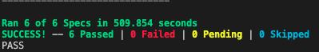
