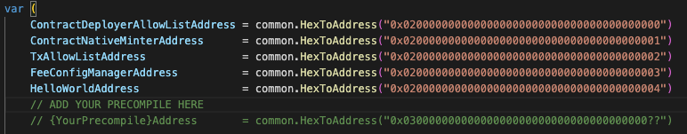

# Precompile Generation Tutorial

We can now generate a stateful precompile with the Precompile gen tool!

### Assumption of Knowledge
Before starting this tutorial it would be helpful if you had some context on the EVM, precompiles, and stateful precompiles. 
Here are some resources to get started put together. 

- [EVM Handbook](https://noxx3xxon.notion.site/noxx3xxon/The-EVM-Handbook-bb38e175cc404111a391907c4975426d)

- [Precompiles in Solidity](https://medium.com/@rbkhmrcr/precompiles-solidity-e5d29bd428c4)

- [Customizing the EVM with Stateful Precompiles](https://medium.com/avalancheavax/customizing-the-evm-with-stateful-precompiles-f44a34f39efd)

 
## Tutorial

Let's start by creating the Solidity interface that we want to implement. We can put this  in `./contract-examples/contracts`

```
// (c) 2022-2023, Ava Labs, Inc. All rights reserved.
// See the file LICENSE for licensing terms.

// SPDX-License-Identifier: MIT

pragma solidity >=0.8.0;

interface IHelloWorld {
  function sayHello() external returns (string calldata);

  // SetGreeting
  function setGreeting(string calldata recipient) external;
}
```

Now we have an interface that our precompile can implement!
Let's create an [abi](https://docs.soliditylang.org/en/v0.8.13/abi-spec.html#:~:text=Contract%20ABI%20Specification-,Basic%20Design,as%20described%20in%20this%20specification.) of our solidity code.

In the same `./contract-examples/contracts` directory, let's run

```
solcjs --abi IHelloWorld.sol
```

This spits out the abi code. Let's move it into a brand new folder in 
`./contract-examples/contracts/contract-abis`. 

IHelloWorld.abi

```
[{"inputs":[],"name":"sayHello","outputs":[{"internalType":"string","name":"","type":"string"}],"stateMutability":"nonpayable","type":"function"},{"inputs":[{"internalType":"string","name":"recipient","type":"string"}],"name":"setGreeting","outputs":[],"stateMutability":"nonpayable","type":"function"}]
```


## Some facts about the precompile tool

The precompile tool takes in 4 arguments. 
```
	abiFlag = &cli.StringFlag{
		Name:  "abi",
		Usage: "Path to the Ethereum contract ABI json to bind, - for STDIN",
	}
	typeFlag = &cli.StringFlag{
		Name:  "type",
		Usage: "Struct name for the precompile (default = ABI name)",
	}
	pkgFlag = &cli.StringFlag{
		Name:  "pkg",
		Usage: "Package name to generate the precompile into (default = precompile)",
	}
	outFlag = &cli.StringFlag{
		Name:  "out",
		Usage: "Output file for the generated precompile (default = STDOUT)",
	}
```

Currently it can only generate precompiles in Golang only.  


## Generating the precompile 

Now that we have an abi for the precompile gen tool to interact with. We can run the following command to generate our HelloWorld precompile!


In the root of the repo run 
```
go run ./cmd/precompilegen/main.go --abi ./contract-examples/contracts/contract-abis/IHelloWorld.abi --out ./precompile/hello_world.go
```

Wow! We just got a precompile template that's 80% complete located at `./precompile/hello_world.go`. Let's fill out the rest!

The precompile gives us commented instructions on the first 25 lines of the autogenerated file. 

```
// Code generated
// This file is a generated precompile contract with stubbed abstract functions.
// The file is generated by a template. Please inspect every code and comment in this file before use.

// There are some must-be-done changes waiting in the file. Each area requiring you to add your code is marked with CUSTOM CODE to make them easy to find and modify.
// Additionally there are other files you need to edit to activate your precompile.
// These areas are highlighted with comments "ADD YOUR PRECOMPILE HERE".
// For testing take a look at other precompile tests in core/stateful_precompile_test.go

/* General guidelines for precompile development:
1- Read the comment and set a suitable contract address in precompile/params.go. E.g:
	IHelloWorldAddress = common.HexToAddress("ASUITABLEHEXADDRESS")
2- Set gas costs here
3- It is recommended to only modify code in the highlighted areas marked with "CUSTOM CODE STARTS HERE". Modifying code outside of these areas should be done with caution and with a deep understanding of how these changes may impact the EVM.
Typically, custom codes are required in only those areas.
4- Add your precompile upgrade in params/config.go
5- Add your upgradable config in params/precompile_config.go
6- Add your solidity interface and test contract to contract-examples/contracts
7- Write solidity tests for your precompile in contract-examples/test
8- Create e2e test for your solidity test in tests/e2e/solidity/suites.go
9- Create your genesis with your precompile enabled in tests/e2e/genesis/
10- Run your e2e precompile Solidity tests with 'E2E=true ./scripts/run.sh'
```

## Step 1 

In `./precompile/params.go` let's set a precompile address. 



Now when subnet evm sees the `HelloWorldAddress` as input when executing [`Call`](https://github.com/ava-labs/subnet-evm/blob/master/core/vm/evm.go#L222), it can [run the precompile](https://github.com/ava-labs/subnet-evm/blob/master/core/vm/evm.go#L271-L272)


## Step 2 
Set up gas costs. For now, I'll set some placeholder numbers since I'm not sure how much gas these functions will cost. 


Example: 
The sha256 precompile computes gas with the following equation
```
// This method does not require any overflow checking as the input size gas costs
// required for anything significant is so high it's impossible to pay for.
func (c *sha256hash) RequiredGas(input []byte) uint64 {
	return uint64(len(input)+31)/32*params.Sha256PerWordGas + params.Sha256BaseGas
}
```


